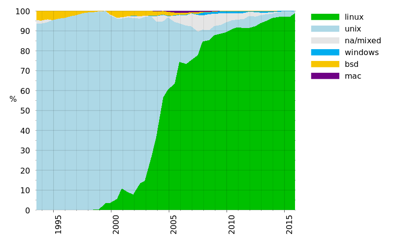
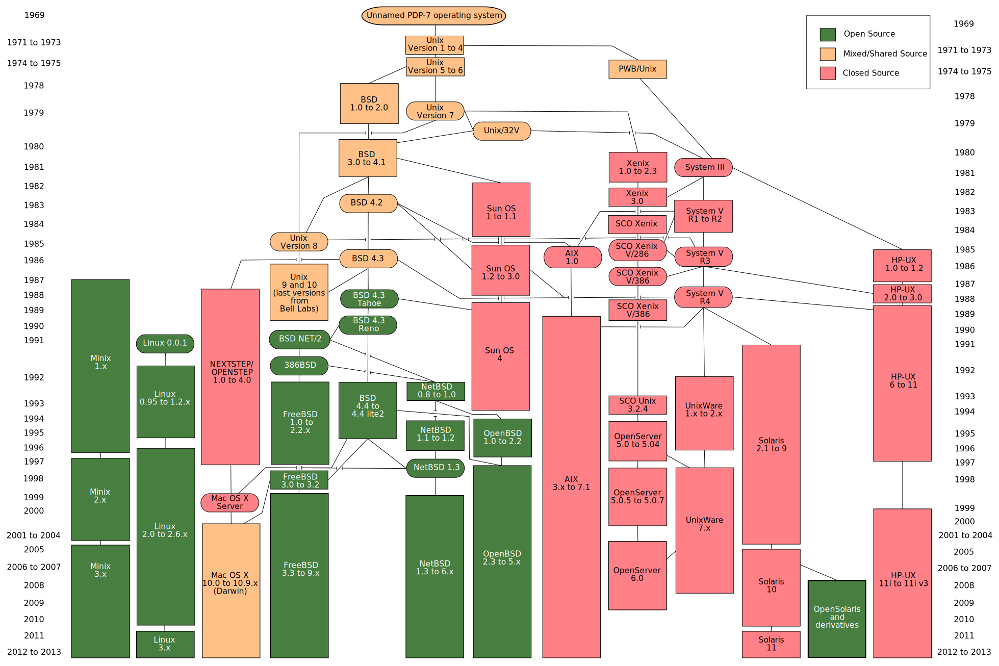

# Linux 系统简介 

标签（空格分隔）： Linux

---
## 什么是Linux?
Linux 是一种自由和开放源代码的 Unix-like 操作系统。

Linux 是自由软件和开放源代码软件发展中最著名的例子。只要遵循GNU（GNU 是“GNU's Not Unix”的递归缩写）通用公共许可证，任何个人和机构都可以自由地使用 Linux 的所有底层源代码，也可以自由地修改和再发布。

Linux 是一个领先的操作系统，可以运行在服务器和其他大型平台之上，如大型主机和超级计算机。到2015年，世界上 500 个最快的超级计算机 (TOP500) 98％ 以上运行 Linux 发行版或其变种。下图为 1995年到2015年 TOP500上操作系统[演化图](https://en.wikipedia.org/wiki/Usage_share_of_operating_systems)。 我国天河二号使用的是麒麟操作系统和 Ubuntu Linux， 它们都是基于 Linux 的系统。 
![Operating_systems_used_on_top_500_supercomputers.svg.png-19.2kB][1]

Linux 也广泛应用在嵌入式系统上，如手机，平板电脑，路由器，电视和电子游戏机等。在移动设备上广泛使用的 Android 操作系统就是创建在 Linux 内核之上。

通常情况下，Linux 被打包成供个人计算机和服务器使用的 Linux 发行版，一些流行的主流 Linux 发布版，包括 Debian（及其派生版本Ubuntu，Linux Mint），Fedora（及其相关版本Red Hat Enterprise Linux，CentOS）和 openSUSE 等。

Linux 发行版包含 Linux 内核和支撑内核的实用程序和库，通常还带有大量可以满足各类需求的应用程序。个人计算机使用的 Linux 发行版通常包 X Window 和一个相应的桌面环境，如 GNOME 或 KDE。桌面 Linux 操作系统常用的应用程序，包括 Firefox 网页浏览器，LibreOffice 办公软件，GIMP 图像处理工具等。

由于 Linux 是自由软件，任何人都可以创建一个符合自己需求的 Linux 发行版。

## Linux的产生历程

* 1983年，理查德·马修·斯托曼( Richard Matthew Stallman )创立了 GNU 计划（GNU 是 “GNU's Not Unix” 的递归缩写）。这个计划有一个目标，是为了发展一个完全自由的 Unix-like 操作系统。在1985年，理查德·马修·斯托曼发起自由软件基金会并且在 1989 年撰写了 GPL 协议。1990 年代早期，GNU 开始大量的产生或收集各种系统所必备的组件，像库、编译器(GCC)、调试工具、文本编辑器、网页服务器，以及一个Unix的使用者接口（Unix shell）,但是像一些底层环境，如硬件驱动、守护进程运行内核（kernel）并不完整和陷于停顿。

* 1990年, 林纳斯·托瓦兹（Linus Torvalds）决定编写一个自己的 Minix 内核，初名为 Linus' Minix， 意为 Linus 的 Minix 内核，后来改名为 Linux，此内核于 1991 年正式发布，并逐渐引起人们的注意。

* 把 GNU 软件与 Linux 内核组合，再添加 X11（X Window 系统）, 就是大家所见到的 Linux。

## Linux的优点

* 开放源代码的Linux可以让知识延续下去，新兴的软件公司可以从开放源代码上快速、低价的创建专业能力，丰富市场的竞争，防止独霸软件巨兽的存在。

* 个人使用很少有版权问题，绝大多数都是免费使用，几乎无所谓盗版问题。

* 新的Linux发布版大多数软件都有服务器的服务，只要点击就可以自动下载、安装经过认证的软件，不需要到市面购买、安装。

* Linux学习的投资有效时间较长。旧版软件、系统都还是存在，有源代码可以派生、分支，维护周期普遍比 Windows 长很多。就算被放弃，还是可以凭借源代码派生。新的软件更新发展多样化，容易养成使用者习惯掌握原理，而不是养成操作习惯。

* 强大的 Shell 及脚本支持，容易组合出符合需求的环境或创造自动程序。

* 默认安全设置相对于目前主流的 Windows 操作系统安全很多.

> 
MINIX 是一种基于微内核架构的 Unix-like 计算机操作系统，由安德鲁·斯图尔特·塔能鲍姆（Andrew S. Tanenbaum）发明。MINIX 最初发布于 1987 年，开放全部源代码给大学教学和研究工作。2000 年重新改为 BSD 授权，成为自由和开放源码软件.

## 3. Unix 和 Unix-like 系统的发展图谱

## 4. Linux 文件系统
Linux的文件系统认为计算机所有对象都是文件或目录，所以了解Linux文件结构显得相当重要。

### Swap分区

即交换区，Swap空间的作用可简单描述为：当系统的物理内存不够用的时候，就需要将物理内存中的一部分空间释放出来，以供当前运行的程序使用。那些被释放的空间可能来自一些很长时间没有什么操作的程序，这些被释放的空间被临时保存到Swap空间中，等到那些程序要运行时，再从Swap中恢复保存的数据到内存中。这样，系统总是在物理内存不够时，才进行Swap交换。 其实，Swap的调整对Linux服务器，特别是Web服务器的性能至关重要。通过调整Swap，有时可以越过系统性能瓶颈，节省系统升级费用。

### Linux 文件结构

|  目录 | 用途|
| :---: | :----|
| /   | 根目录，为文件系统的入口目录|
|/boot | 系统启动目录，包含了操作系统的内核和在启动系统过程中所要用到的文件| 
| /dev | 设备目录， 如其中的 hda1, hda2等文件, 它们代表系统主硬盘的不同分区 |
| /etc | 存放系统程序或者一般工具的配置文件。|
| /home | 是所有用户的家目录所在地。比如`/home/why` 是用户 `why` 的家目录。|
| /lib | 库文件目录， 这里包含了系统程序所需要的所有共享库文件。|
| /media | 即插即用型存储设备的挂载点自动在这个目录下创建文件夹。 |
| /opt | 表示的是可选择的意思，一些大型的软件包可以装到这里， 如 Matlab|
| /proc | 虚拟文件目录，操作系统运行时，进程（正在运行中的程序）信息及内核信息（比如cpu、硬盘分区、内存信息等）存放在这里。/proc目录是伪装的文件系统proc的挂载目录，proc并不是真正的文件系统。这是系统中极为特殊的一个目录，实际上任何分区上都不存在这个目录。它实际是个实时的、驻留在内存中的文件系统。|
| /root | Linux超级权限用户root的家目录。|
|/sbin | 大多是涉及系统管理的命令的存放，是超级权限用户root的可执行命令存放地，普通用户无权限执行这个目录下的命令。|
| /tmp | 临时文件目录，有时用户运行程序的时候，会产生临时文件， 一般都放在这个目录。|
| /usr | 这个是系统存放程序的目录，比如命令、帮助文件等。这个目录下有很多的文件和目录。当我们安装一个Linux发行版官方提供的软件包时，大多安装在这里。如果有涉及服务器配置文件的，会把配置文件安装在/etc目录中。|

### Linux 文件系统的优点

1. 一切皆是文件，屏蔽所有设备细节。
2. 磁盘管理效率高，没有磁盘整理的烦恼。

---
[上一篇:Unix 系统简介](https://www.zybuluo.com/why-math/note/248492)

---
[下一篇: Ubuntu系统简介与安装](https://www.zybuluo.com/why-math/note/248606)

  [1]: http://static.zybuluo.com/why-math/27093bg018dnym9kvzr3knm7/Operating_systems_used_on_top_500_supercomputers.svg.png
  [2]: http://static.zybuluo.com/why-math/ichonaj3d8hu67b50kpg1mm4/Unix_history-simple.svg
