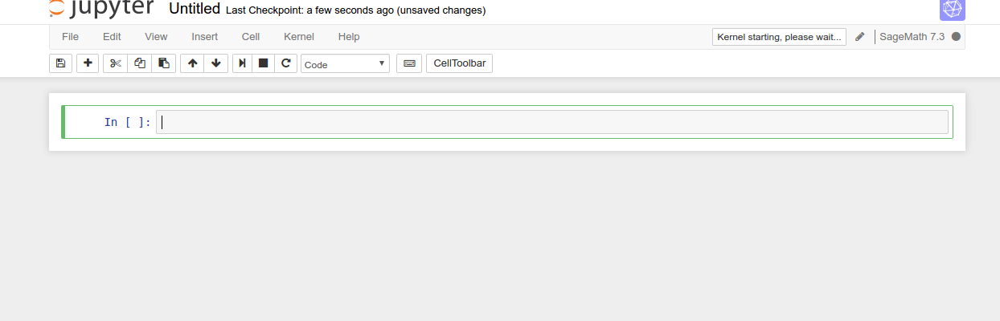

# Ubuntu 系统的安装与配置

本节主要介绍 ubuntu 的安装和配置过程, 完成这一过程就可以得到一个方便使用的系统. 

## 简介

Ubuntu 是一个以桌面应用为主的 Linux 操作系统,其名称来自非洲南部祖鲁语或豪萨语的 “ubuntu”
一词(译为吾帮托或乌班图),意思是“人性”、“我的存在是因为大家的存在”,是非洲传统的一种价值观,
类似华人社会的“仁爱”思想.Ubuntu 基于 Debian 发行版和 GNOME 桌面环境,与 Debian 的不同在于
它每6个月会发布一个新版本.Ubuntu 的目标在于为一般用户提供一个最新的、同时又相当稳定的主要
由自由软件构建而成的操作系统.Ubuntu 具有庞大的社区力量,用户可以方便地从社区获得帮助.

1. **自由软件**                                                                                                        
Ubuntu 项目完全遵从开源软件开发的原则;并且鼓励人们使用、完善并传播开源软件.也就是 Ubuntu 
目前是并将永远是免费的. 然而,这并不仅仅意味着零成本,自由软件的理念是人们应该以所有
“对社会有用”的方式自由地使用软件.“自由软件”并不只意味着您不需要为其支付费用,它也意味着
您可以以自己想要的方式使用软件：任何人可以任意方式下载、修改、修正和使用组成自由软件的代码.
因此,除去自由软件常以免费方式提供这一事实外,这种自由也有着技术上的优势：进行程序开发时,
就可以使用其他人的成果或以此为基础进行开发.对于非自由软件而言,这点就无法实现,进行程序开发
时,人们总得白手起家.基于上述原因,自由软件的开发是迅捷、高效和激动人心的!

1. **桌面环境**                                                                                                           
Ubuntu 默认桌面环境采用 GNOME(The GNU Network Object Model Environment,GNU 网络对象模型环境),
一个 UNIX 和 Linux 主流桌面套件和开发平台.另一个 UNIX 和 Linux 主流桌面环境是 KDE(K桌面环境,
K Desktop Environment).

1. **后备与支持**　                                                                                                       
Ubuntu 由一个快速壮大的社区进行维护, 可以免费得到社区及专业机构的支持.Kubuntu、Xubuntu、
Edubuntu　和　Goubuntu　是　Ubuntu　计划正式支援的衍生版本. Kubuntu　和 Xubuntu 分别将 KDE
与 Xfce 桌面环境带入 Ubuntu.Edubuntu 则是一个为了学校教学环境而设计,并且让小孩在家中也可
以轻松学会使用的衍生版本.而Goubuntu则是完全使用开源软件基金会认定的自由软件构建的发行版本.

1. **文件结构**                                                                                                          
Windows 的文件结构是多个并列的树状结构,最顶部的是不同的磁盘（分区）,如：C,D,E,F等.
而 Linux 的文件结构是单个的树状结构.可以用 tree 进行展示. 在 Ubuntu下安装 tree（sudo apt-get install tree）,
并可通过命令来查看.每次安装系统的时候我们都会进行分区,Linux 下磁盘分区和目录的关系如下：
 - 任何一个分区都必须挂载到某个目录上.
 - 目录是逻辑上的区分.分区是物理上的区分.
 - 磁盘Linux分区都必须挂载到目录树中的某个具体的目录上才能进行读写操作.
 - 根目录是所有Linux的文件和目录所在的地方,需要挂载上一个磁盘分区.


## 系统安装

* 将 ubuntu 的启动插在电脑上,重启电脑,开机时按 F12；
但是对于有些电脑按 F12 没反应,先查查该电脑的启动键是
哪一个,再根据不同型号的电脑按相应的键；如果上述过程
做了还是没反应,那么查查电脑是否真正的关机,对于有些
电脑为了方便它是处于睡眠状态,没有真正的关机,
这时侯按照 shift + 关机键,使电脑关机以后再按相应的相应
键启动．出现下图:


* 图中显示 try ubuntu 和 install ubuntu 两个按钮,
第一个是体验 ubuntu系统,第二个是直接安装 ubuntu 系统,
可以体验之后再安装,也可以也可直接安装．点击 
install ubuntu 之后,出现下图:


* 不选择安装第三方软件,点击继续；出现下图:


* 安装类型选择其他,这样我们可以自己选择分区,继续,出现下图:

 

* 分区设置, 点击"-" 把 Window 下划分出的磁盘空间变成空闲分区,选中空闲分区,
新建分区,点击“+” , 设置交换空间 swap, 这里电脑内存是多少 G 就划分多少；
新建分区,点击“+” , 设置“/”主分区, 相当于 Win7 的系统 C 盘, 同样的方
法, 将剩余空间设置“/home”分区, 用于存文件,如下图所示:

 

* 选择上海:

 

* 选择美国键盘:
 
 

* 进入用户设置, 自行设置用户名、密码：

 

* 进入安装界面,等待安装,安装好之后重启电脑．


## 应用程序安装

系统安装好之后,我们还得需要一些基本的软件或者程序来帮助我们更好的工作,
因此现在需要安装应用程序.

### sagemath
                                                         
Sage 是一个免费的、开源的数学软件系统,采用GPL协议.它整合了许多开源Python包,
采用Python语言编写,但也支持其他语言.它的目标是创造一个可变的开源软件以替代
Magma、Maple、Mathematica和Matlab.Sage不仅是一个软件,也是一个编程环境,提供
命令行模式、笔记本模式,可以编写编译型程序和解释型程序.目前Sage支持Linux、
Mac OS X、BSD、Solaris平台. 项目主页是http://www.sagemath.org/.
             
Sage程序较大,但是提供了网络接口,就是说,用户可以在不安装整个程序的情况下,
在服务器上运行 Sage 的笔记本模式.可以通过扩展阅读中提供的地址注册账号免费试用.
也可以在自己的服务器上架设 Sage.使用时,可以随时点击右上角的Help获取帮助.对于
使用 Sage 基本功能的四则运算、微积分、线性代数、数论图论等,网络版 Notebook 完全
可以应付.如果需要3D作图,需要浏览器支持 Java.

sagemath 安装：
```
sudo apt-get -y install sagemath-upstream-binary
```
### Jupyter

Jupyter Notebook（此前被称为 IPython notebook）是一个交互式笔记本,支持运行 40 多种编程语言.
这对于希望编写漂亮的交互式文档的人来说是一个强大工具.在开始使用 notebook 之前,我们先需要
安装该库.可以在 Jupyter 官网上找到完整的步骤.
1. 基本用法
  - 会在你开启 notebook 的文件夹中启动 Jupyter 主界面,如下所示：

  - 如果想新建一个 notebook,只需要点击 New,选择你希望启动的 notebook 类型即可.

这里,因为我只有一个 sagemath 和 python 两个内核,所以我们运行一个 sagemath notebook.
在新打开的标签页中,我们会看到 notebook 界面,目前里面什么也没有.

  - notebook 界面由以下部分组成：
    -  notebook 的名称;
    -  主工具栏,提供了保存、导出、重载 notebook,以及重启内核等选项;
    -  快捷键;
    -  notebook 主要区域,包含了 notebook 的内容编辑区;
  - 下方的主要区域,由被称为单元格的部分组成.每个 notebook 由多个单元格构成,而每个单元格
又可以有不同的用途. 下图中看到的是一个代码单元格（code cell）,以[]开头.在这种类型的
单元格中,可以输入任意代码并执行.例如,输入1 + 2并按下Shift + Enter.之后,单元格中
的代码就会被计算,光标也会被移动动一个新的单元格中.会得到如下结果：

接下来,我们在第二个单元格中输入些其他代码,例如,输入 
```
y=1+2
print y
```
会得到：

这次没有出现类似Out[20]这样的文字.这是因为我们将结果打印出来了,没有返回任何的值.
我们需要编辑文本内容,那么使用其他类型的单元格,Markdown单元格.退出编辑,按 m 进入
markdown 单元格.markdown 单元格还支持 LaTex 语法.例如,输入
```
$$\frac{\partial y}{\partial t} + t = x$$
```
显示如下结果：

1. 单元格操作
  - 如果想删除某个单元格,可以选择该单元格,然后依次点击Edit -> Delete Cell;
  - 如果想移动某个单元格,只需要依次点击Edit -> Move cell [up | down];
  - 如果想剪贴某个单元测,可以先点击Edit -> Cut Cell,然后在点击Edit -> Paste Cell [Above | Below];
  - 如果你的 notebook 中有很多单元格只需要执行一次,或者想一次性执行大段代码,
    那么可以选择合并这些单元格.点击Edit -> Merge Cell [Above | below].
1. 导出功能
  notebook 还有一个强大的特性,就是其导出功能.可以将 notebook 导出为多种格式：
  - HTML
  - Markdown
  - ReST
  - PDF（通过 LaTeX）
  - Raw Python

### gitbook 

1. gitbook 是一个软件,它使用 Git 和 Markdown 来编排书本.可以生成多种格式的书:
  - 静态网站: 这是默认格式, 生成一个完整的交互静态网站;
  - PDF: 一个完整的PDF书籍, 在书末带有练习解决方案;
  - eBook: 一个完整的ePub格式的eBook,在书末带有练习解决方案.
GitBook 工具链是开源和完全免费的, 工具源码在 GitHub.
1. GitBook 使用 Markdown文件.
书籍是一个Git仓库至少包含这两个文件: README.md 和 SUMMARY.md.
  - **README.md:** 通常情况下,这应该是介绍你的书.它会自动添加到最终摘要.
  - **SUMMARY.md:**是最重要的一个部分, 它创建的是整书的索引, 你也可以通过
gitbook init读取SUMMARY.md来生成目录结构,其他的文件可以根据需要自行添加.
1. Gitbook 的安装
```
sudo apt-get install npm nodejs nodejs-dev nodejs-legacy
sudo npm install -g gitbook
sudo apt-get install calibre ebook-speaker
```
需要注意的是：用户首先需要安装 nodejs,以便能够使用 npm 来安装 gitbook.
1. gitbook 的基本用法
gitbook　的基本用法非常简单,基本上就只有两步：
  - 使用 gitbook init 初始化书籍目录
  - 使用 gitbook serve 编译书籍

## 基本配置

### Mentohost 

**配置有线网络**

1. 从网上下载 mentohust 的 deb 文件,
下载地址:https : //code.google.com/p/mentohust/downloads/list
出现下图:

电脑是32位的下载使用:mentohust_0.3.4-1_i386.deb
电脑是64位的下载使用:mentohust_0.3.4-1_amd64.deb
1. 安装 mentohust 
```
 进入 mentohust 的 deb 安装包所在目录；
 使用命令执行安装: sudo dpkg -i mentohust xxx.deb
```
  1. 修改 IP 
    * 鼠标点击右上角的网络连接,选择编辑网络,出现下图:
 
 点击 wired connection 1 ,选择 edit 出现下图:
 
修改 IP4 的网址,默认网关,DNS
    * 用以下命令打开 Network connection ,选择 Ethernet 下的 Wired connection 1,修改 IP4 的网址,默认网关,DNS
```
nm-connection-editor
```
  1. 查看网络配置,找到 etho
```
ifconfig
```
  1. 配置并登录网络
```
sudo mentohust -b1
网卡[1]:
网卡[2]:
请选择网卡:1
请输入用户名:
请输入密码:
请选择组播地址(0 标准之 1 锐捷私有 2 赛尔):0
请选择DHCP方式(0 不使用 1 二次认证 2 认证后 3 认证前):0
```
  1. 断网
```
sudo mentohust -k
```

### vim 

### git 

### chrome 


## 自动配置脚本


1. 访问 Google
1. 聊天工具

