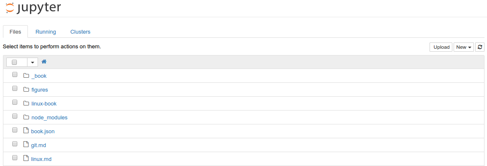
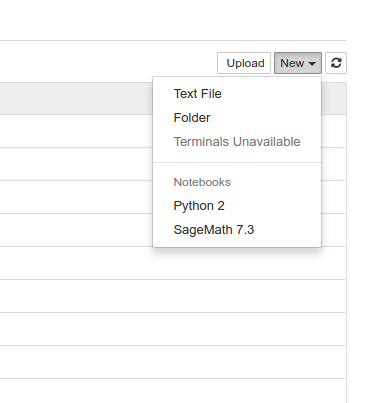
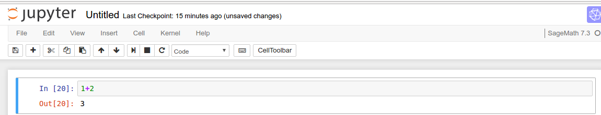

# Ubuntu 的用法

## 系统配置

**一   进入系统配置之前,我们首先学习 ubuntu 安装软件的方法**

* 软件中心界面安装.
* 命令行安装:
  * deb 安装包,是 Debian 软件包格式的文件扩展名,Debian 包是 Unixar 的标准归档，将包文件
信息以及包内容，经过 gzip 和 tar 打包而成. deb 包在 Linux 操作系统中类似于 windows 中
的软件包（exe)，几乎不需要什么复杂的编译即可通过鼠标点击安装使用.处理这些包的经典程序
是dpkg.其命令为:
```
sudo dpkg -i(r) xxx.deb
```
  * apt-get:
 apt-get是一条linux命令，适用于deb包管理式的操作系统，主要用于自动从互联网的软件仓库
中搜索、安装、升级、卸载软件或操作系统.apt-get命令一般需要root权限执行，所以一般跟着
sudo命令 :

```
sudo apt-get install xxx # 安装软件
sudo apt-get remove xxx # 卸载软件
```

**二  开始配置系统环境**

* 配置有线网络

* 从网上下载 mentohust 的 deb 文件,

下载地址:https : //code.google.com/p/mentohust/downloads/list

出现下图:



电脑是32位的下载使用:mentohust_0.3.4-1_i386.deb

电脑是64位的下载使用:mentohust_0.3.4-1_amd64.deb

* 安装 mentohust 
```
 进入 mentohust 的 deb 安装包所在目录；
 使用命令执行安装: sudo dpkg -i mentohust xxx.deb
```
  * 修改 IP 
    * 鼠标点击右上角的网络连接,选择编辑网络,出现下图:
 
 点击 wired connection 1 ,选择 edit 出现下图:
 
修改 IP4 的网址,默认网关,DNS
    * 用以下命令打开 Network connection ,选择 Ethernet 下的 Wired connection 1,修改 IP4 的网址,默认网关,DNS
```
nm-connection-editor
```
  * 查看网络配置,找到 etho
```
ifconfig
```
  * 配置并登录网络
```
sudo mentohust -b1
网卡[1]:
网卡[2]:
请选择网卡:1
请输入用户名:
请输入密码:
请选择组播地址(0 标准之 1 锐捷私有 2 赛尔):0
请选择DHCP方式(0 不使用 1 二次认证 2 认证后 3 认证前):0
```
  * 断网
```
sudo mentohust -k
```

* 更新源
  * 点击左边 ubuntu software,然后点击左上角的 software & update,出现下图:

把 Download from 中改为 Main serve,更新；
```
sudo apt-get update
```
  * 命令
```
sudo gedit /etc/apt/source.list
先把里边的内容删除,再把163的源列表拷贝到这里,保存
sudo apt-get update
```
  * 163源列表
```
deb http://mirrors.163.com/ubuntu/ trusty main restricted universe multiverse
deb−src http://mirrors.163.com/ubuntu/ trusty main restricted universe multiverse
deb http://mirrors.163.com/ubuntu/ trusty−security main restricted universe multiverse
deb−src http://mirrors.163.com/ubuntu/ trusty−security main restricted universe multiverse
deb http://mirrors.163.com/ubuntu/ trusty−updates main restricted universe multiverse
deb−src http://mirrors.163.com/ubuntu/ trusty−updates main restricted universe multiverse
deb http://mirrors.163.com/ubuntu/ trusty−proposed main restricted universe multiverse
deb−src http://mirrors.163.com/ubuntu/ trusty−proposed main restricted universe multiverse
deb http://mirrors.163.com/ubuntu/ trusty−backports main restricted universe multiverse
deb−src http://mirrors.163.com/ubuntu/ trusty−backports main restricted universe multiverse
```

* 使用配置文件

更改 ubuntu_install.sh 的权限,再执行,安装好 ubuntu_install.sh 中的软件,其中,ubuntu_install.sh 是一个配置文件

```
sudo chmod 777 ubuntu_install.sh
sudo ./ubuntu_install.sh
```


